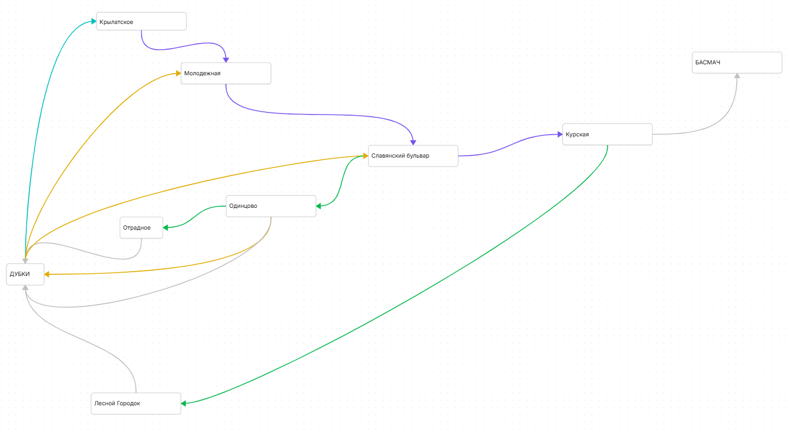

# DubkiRouteFinder

Веб-сервис для поиска наиболее оптимального маршрута от Студенческого городка "Дубки" до учебного корпуса НИУ ВШЭ на Старой Басманной. 

Программа выводит пять наиболее оптимальных в указанное время маршрутов от начальной точки до конечной (искать маршрут от промежуточных станций также возможно). Есть два варианта поиска:
1. Наиболее быстрый
2. Наименее проходящий по улице (актуален, например, в дождливую погоду)

_Авторы: Егоров Евгений, Карамуллина София, БФИКЛ241_

## Установка / Запуск
Проект представляет собой веб-сервис на Flask.
Проект может быть запущен локально путем запуска файла 
```run.py```
в корневой директории проекта.

## Структура проекта
Проект представляет собой веб-сервис на Flask. Тематически разделён на три основные директории:
- _app_: содержит Flask-оболочку проекта
- _core_: содержит логику поиска оптимального маршрута
- _data_: хранит json-файлы с маршрутами и расписанием транспорта

## Логика работы и используемые алгоритмы

### Маршрутная сеть

Маршрутная сеть представлена в виде взвешенного графа, где вершины - остановочные пункты транспорта, а ребра - транспортные и пешеходные связи между ними.
Вес рёбер - время прохождения участка пути в минутах.

Вес рёбер в графе динамический и может меняться в зависимости от текущего времени, если для данного ребра существует расписание движения транспорта (маршруты дубовозок до Одинцово, Молодёжной и Славянского Бульвара, а также городские автобусы до м. Крылатское): время ожидания рассчитывается как время до ближайшего ко времени прибытия на остановку автобуса.



## Алгоритмы

Для поиска кратчайшего маршрута во взвешенном графе используется **алгоритм Дейкстры** (O(V^2)), модифицированный под зависящий от текущего времени вес рёбер. 
Для поиска нескольких наиболее оптимальных маршрутов - возвратный (не заканчивающийся при первом нахождении конечной вершины) **поиск в глубину** - для ограниченного размера графа и задачи вывести несколько подходящих маршрутов мы сочли такой вариант подходящим для наших целей.

Для сортировки используется алгоритм **сортировки вставкой** (сложность - O(n^2) в худшем случае, O(n) в лучшем).

